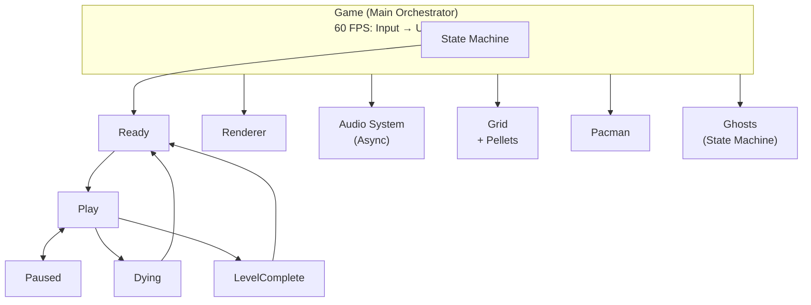
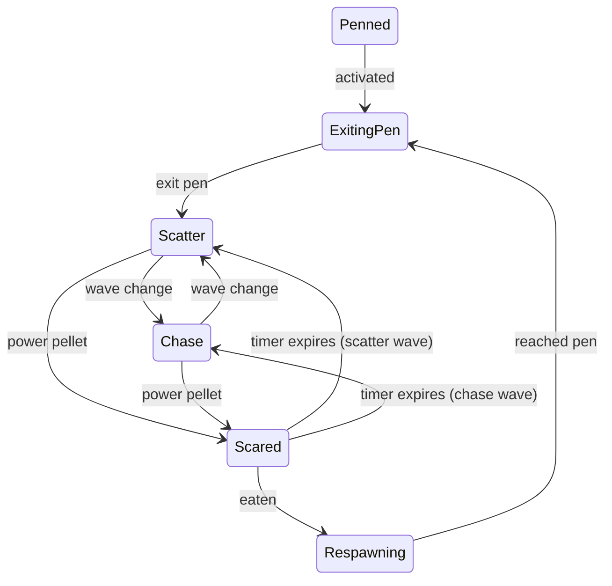

# Pacman

A clean C++20 Pac-Man implementation using SDL2, designed for readability and extensibility.


## Table of Contents

- [Prerequisites](#prerequisites)
- [Building and Running](#building-and-running)
- [Controls](#controls)
- [Asset Configuration](#asset-configuration)
- [Architecture Overview](#architecture-overview)
- [Core Systems](#core-systems)
- [Entities](#entities)
- [Ghost AI](#ghost-ai)
- [Extending the Game](#extending-the-game)
- [Known Limitations](#known-limitations)

## Prerequisites

**Required:**
- CMake 3.16+
- C++20 compiler (GCC 10+, Clang 10+, or MSVC 2019+)
- SDL2, SDL2_image, SDL2_mixer

**Optional:**
- clang-tidy (auto-enabled if found)
- clang-format

### macOS (Homebrew)

```bash
brew install cmake sdl2 sdl2_image sdl2_mixer
brew install llvm  # For clang-tidy and clang-format
```

### Ubuntu/Debian

```bash
sudo apt-get install cmake build-essential \
    libsdl2-dev libsdl2-image-dev libsdl2-mixer-dev \
    clang-tidy clang-format
```

## Building and Running

```bash
# Clone and build
git clone https://github.com/wboayue/pacman.git
cd pacman
mkdir -p build && cd build
cmake .. -DCMAKE_BUILD_TYPE=Release
make -j4

# Run (from build directory)
./pacman
```

**Important:** Run the executable from the `build/` directory so asset paths resolve correctly (default: `../assets`).

### Build Options

```bash
# Debug build
cmake .. -DCMAKE_BUILD_TYPE=Debug

# Disable clang-tidy
cmake .. -DENABLE_CLANG_TIDY=OFF

# Format source code
cmake --build . --target clang-format

# Check formatting
cmake --build . --target clang-format-check
```

## Controls

| Key | Action |
|-----|--------|
| Arrow Keys | Move Pacman |
| P | Pause/Resume |
| ESC | Quit |

## Asset Configuration

Assets are loaded from `../assets` relative to the executable by default.

To use a custom asset directory, set the `ASSET_PATH` environment variable:

```bash
# Unix/macOS
export ASSET_PATH=/path/to/custom/assets
./pacman

# Or inline
ASSET_PATH=/path/to/custom/assets ./pacman
```

### Asset Directory Structure

```
assets/
├── maze.txt                 # Level layout (28x36 grid)
├── sounds/
│   ├── game_start.wav       # Intro music
│   ├── munch_1.wav          # Pellet eating sound 1
│   ├── munch_2.wav          # Pellet eating sound 2
│   ├── power_pellet.wav     # Power pellet loop
│   └── death_1.wav          # Death sound
└── sprites/
    ├── pacman.png           # Pacman animation frames
    ├── blinky.png           # Red ghost
    ├── pinky.png            # Pink ghost
    ├── inky.png             # Cyan ghost
    ├── clyde.png            # Orange ghost
    ├── scared-ghost.png     # Frightened ghost
    ├── ghost-eyes.png       # Respawning ghost
    ├── pellet.png           # Regular pellet
    ├── power-pellet.png     # Power pellet
    ├── maze.png             # Maze background
    ├── fruits.png           # Bonus fruits
    └── white-text.png       # Score/UI text
```

## Architecture Overview



### Design Patterns

- **State Pattern**: Game states (Ready, Play, Paused, Dying, LevelComplete) and ghost behavior states
- **Manager Pattern**: Dedicated managers for assets, board rendering, and audio
- **Factory Pattern**: Ghost state creation via factory methods

## Core Systems

### Game Loop (`src/game.cpp`)

The `Game` class orchestrates the main loop at 60 FPS:

1. **Input**: Process SDL events and keyboard state
2. **Update**: Update entities, animations, and wave manager
3. **Render**: Clear → maze → pellets → ghosts → pacman → present

### Game States

| State | Duration | Description |
|-------|----------|-------------|
| Ready | 4s | Reset positions, play intro sound |
| Play | - | Main gameplay, processes input |
| Paused | - | Freezes all entities, waits for P key |
| Dying | 2s | Death animation, decrement lives |
| LevelComplete | 2s | Reset for next level |

### Audio System (`src/audio-system.cpp`)

Thread-safe asynchronous audio using SDL_mixer:

- Dedicated audio thread processes a request queue
- 16 concurrent audio channels
- Sound handle system for cancellation
- Mutex-protected queue operations

### Asset Manager (`src/asset-manager.cpp`)

Centralized resource loading with caching:

- `AssetRegistry`: Maps enums to file paths
- `AssetManager`: Loads and caches textures/sounds
- Automatic cleanup in destructor

### Renderer (`src/renderer.cpp`)

SDL2 rendering wrapper:

- Hardware-accelerated rendering
- Maintains 224:288 aspect ratio on resize
- Logical resolution scaling

## Entities

### Pacman (`src/pacman.cpp`)

Player-controlled character:

- **Speed**: 75.76 × 0.8 = 60.6 pixels/second
- **Home Position**: Cell (13, 26)
- **Energizer Duration**: 6 seconds
- Tunnel wrapping at row 17

### Ghost (`src/ghost.cpp`)

AI-controlled enemies with individual personalities:

| Ghost | Color | Personality | Scatter Corner |
|-------|-------|-------------|----------------|
| Blinky | Red | Direct chase | Top-right |
| Pinky | Pink | Ambush (4 cells ahead) | Top-left |
| Inky | Cyan | Unpredictable (uses Blinky's position) | Bottom-right |
| Clyde | Orange | Shy (retreats when close) | Bottom-left |

### Pellets (`src/pellet.cpp`)

- **Regular Pellet**: 10 points
- **Power Pellet**: 50 points, enables ghost eating for 6s
- **Total**: 244 pellets per level

## Ghost AI

### Ghost States



| State | Behavior |
|-------|----------|
| Penned | Bounce in ghost pen until activated |
| ExitingPen | Move upward out of pen |
| Scatter | Move to corner, ignore Pacman |
| Chase | Pursue Pacman using personality targeting |
| Scared | Flee randomly, can be eaten |
| Respawning | Return to pen at 2x speed |

### Wave Pattern

Ghosts alternate between Scatter and Chase modes:

| Wave | Mode | Duration |
|------|------|----------|
| 1 | Scatter | 7s |
| 2 | Chase | 20s |
| 3 | Scatter | 7s |
| 4 | Chase | 20s |
| 5 | Scatter | 5s |
| 6 | Chase | 20s |
| 7 | Scatter | 5s |
| 8 | Chase | ∞ |

## Extending the Game

### Add a New Sound

1. Add enum to `Sounds` in `src/asset-registry.h`
2. Map path in `GetSoundPath()` in `src/asset-registry.cpp`
3. Place WAV file in `assets/sounds/`
4. Play with `game.PlaySound(Sounds::kNewSound)`

### Add a New Ghost

1. Create config class inheriting `GhostConfig` in `src/ghost.cpp`
2. Implement `GetTargeter()` with targeting logic
3. Set start position, scatter cell, and sprite
4. Instantiate in `Game::createGhosts()`

### Modify Wave Timing

Edit `kWaves` array in `src/game-context.h`:

```cpp
static constexpr std::array<std::pair<GhostMode, float>, 8> kWaves{{
  {GhostMode::kScatter, 7.0f},   // Duration in seconds
  {GhostMode::kChase, 20.0f},
  // ...
}};
```

### Adjust Game Constants

Key values in `src/constants.h`:

| Constant | Default | Description |
|----------|---------|-------------|
| `kMaxSpeed` | 75.76 | Base movement speed |
| `kPacmanSpeedMultiplier` | 0.8 | Pacman speed factor |
| `kGhostSpeedMultiplier` | 0.73 | Ghost speed factor |
| `kEnergizerDuration` | 6.0 | Power pellet duration (seconds) |
| `kPelletPoints` | 10 | Points per pellet |
| `kGhostPoints` | 200 | Points per ghost eaten |

### Add a New Game State

1. Add to `GameStates` enum in `src/game.h`
2. Create state struct with `Enter()` and `Tick()` methods
3. Register in `initializeStates()` map

## Project Structure

```
pacman/
├── CMakeLists.txt          # Build configuration
├── assets/                 # Game assets
│   ├── maze.txt
│   ├── sounds/
│   └── sprites/
└── src/
    ├── main.cpp            # Entry point
    ├── game.h/cpp          # Game loop and state machine
    ├── renderer.h/cpp      # SDL2 rendering
    ├── audio-system.h/cpp  # Async audio
    ├── asset-manager.h/cpp # Resource loading
    ├── asset-registry.h/cpp# Asset path mapping
    ├── board-manager.h/cpp # UI rendering (score, lives)
    ├── pacman.h/cpp        # Player entity
    ├── ghost.h/cpp         # Ghost AI and states
    ├── grid.h/cpp          # Game board
    ├── pellet.h/cpp        # Collectibles
    ├── sprite.h/cpp        # Animated sprites
    ├── game-context.h/cpp  # Game state and wave manager
    ├── vector2.h/cpp       # 2D vector math
    └── constants.h         # Game constants
```

## Known Limitations

This implementation focuses on core gameplay. Not yet implemented:

- **Cut scenes**: No intermission animations between levels
- **Level progression**: Levels don't increase in difficulty (speed, ghost behavior)
- **Fruit bonus**: Bonus fruits appear but scoring not fully implemented
- **High score**: No persistent high score tracking
- **Multiple lives animation**: No extra life indicator animation
- **Sound variations**: Limited sound variety compared to original arcade

## License

This project is licensed under the [MIT License](LICENSE).
